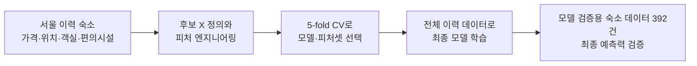
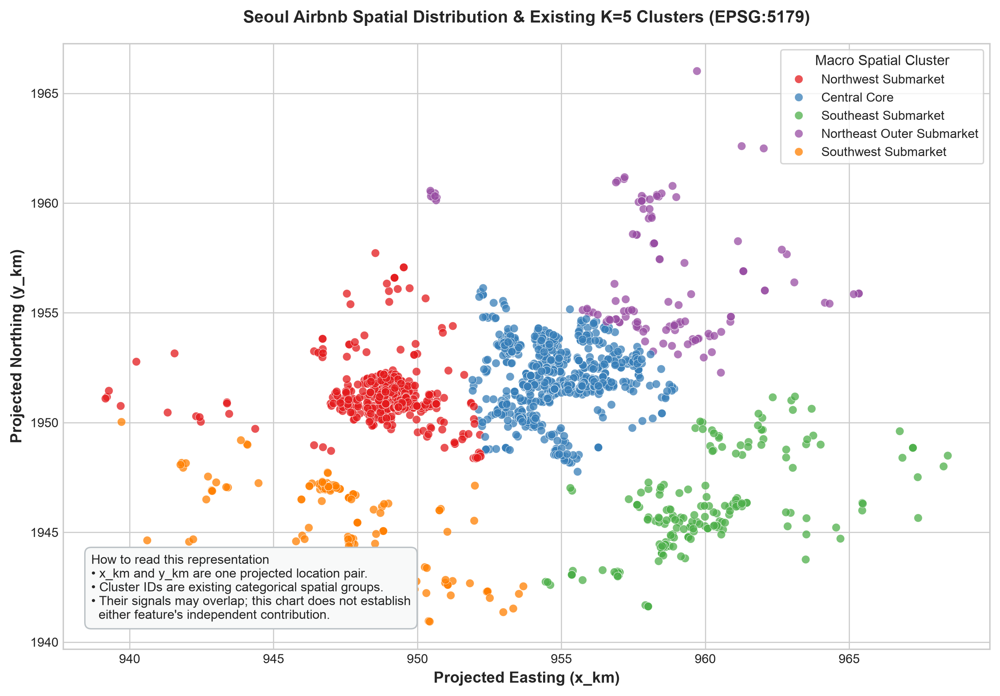

# 서울 Airbnb 1박 가격 예측 모델

2025년 기준 에어비엔비에 등록된 서울 소재 숙소는 17,000여곳에 달한다고 한다.
이때 새로 숙소를 여는 호스트는 숙박료를 어떻게 책정하는게 좋을까? 너무 저렴해도, 너무 비싸도 손해를 볼 여지가 있으니 적정 가격을 미리 알 수 있다면 좋을 것이다.

이 보고서는 에어비엔비 숙소의 1박 가격을 Y값으로 정하고 이를 예측하기 위해 어떤 X 변수를 탐구·정의·선택했는지, 그리고 그 X 변수로 만든 모델이 외부 신규 숙소에서 어느 정도의 예측력을 보였는지를 설명한다.

## 1. 데이터 수집과 목표변수(Y) 설정

### 데이터 수집

크롤링을 통해 서울 Airbnb 숙소 정보를 수집했으며, 수집된 데이터셋은 총 37개 변수를 포함하고 중복을 제거한 고유 숙소는 총 1,955건(서울 소재 1,920건)이다. 각 숙소에서 위치·객실·편의시설과 함께 특정 숙박 기간에 대한 총 숙박요금을 가져왔다. 견적 기간은 대부분 5박이고 일부는 6박 또는 7박이므로, 총액을 그대로 비교하면 숙박 기간 차이가 가격 차이처럼 보일 수 있다.

### Y 설정

따라서 이 보고서에서 예측할 Y는 **숙소의 1박당 가격을 로그로 바꾼 값**이다. 먼저 각 숙소의 총 숙박요금을 그 견적의 숙박일수로 나눠 1박 가격으로 맞춘다. 여기서 숙박일수는 수집한 견적의 기간이며, 숙소가 요구하는 최저 숙박일과 같다고 단정하지 않는다.

그 다음 1박 가격에 로그를 적용한다. 숙소 가격은 몇 배씩 차이 날 수 있어, 원래 가격 그대로 학습하면 매우 비싼 숙소 몇 개가 모델의 오차를 과도하게 좌우할 수 있기 때문이다. 로그 변환은 가격 분포를 덜 치우치게 만들어 모델이 일반적인 가격대의 차이도 함께 학습하도록 돕는다. 모델은 로그 가격을 예측하고, 최종적으로 다시 1박 가격으로 변환해 제시한다.

수용 인원으로 다시 나눈 1박 가격은 보조 분석용 결과다. 최종 모델과 모델 검증용 숙소 데이터 평가는 **주된 1박 가격 Y**를 사용한다.

## 2. 데이터 수집·분석 단위·데이터 품질

### 분석 단위와 모집단

원천은 `raw_data/airbnb2.db`의 두 차례 크롤링 통합 데이터다. 분석 단위는 **숙소(listing) 1건당 1행**이며, 서울로 분류된 이력 숙소는 1,920건이다. 가격·좌표·군집·객실 요약·편의시설은 숙소 ID로 결합하고, 다대일인 편의시설과 텍스트 요약은 숙소 단위로 집계한 뒤 붙인다.

서울 외 숙소, 양수가 아닌 가격, 필요한 공통 결과값이나 수용 인원이 없는 행은 학습 모집단에서 제외한다. 호스트·날짜·가격 자체와 같은 제외 변수는 뒤의 X 변수 절에서 설명한다.

### 가격 품질 감사

가격 분포의 3×IQR 로그 울타리는 약 **$0.36~$65,693/night**이다. `PRICE_UNIT_ERROR`로 등록된 11건의 가격은 약 **$3,949~$91,011/night** 범위이며, $91,011인 1건만 3×IQR 통계 플래그에도 걸린다. 나머지 10건은 통계 울타리 안에 남는다.

따라서 3×IQR은 분포상 극단값을 표시하는 투명한 규칙이지만, 통화 단위나 가격 구성요소가 잘못 읽혔는지 판별하는 규칙은 아니다. 통계 플래그와 `LISTING_EXCLUSION`의 도메인 감사 기록을 별도로 보존한다.

기준 모델은 기존 절차를 재현해 3×IQR에 걸린 등록 오류 1건만 제외하고 나머지 10건을 포함한다. 수정 모델은 `PRICE_UNIT_ERROR` 11건을 먼저 제외하고 동일한 3×IQR 규칙을 적용한다.

| 학습 모집단 | `PRICE_UNIT_ERROR` 제외 | 3×IQR 통계 플래그 | 3×IQR로 추가 제외 | 최종 학습 행 |
| --- | ---: | ---: | ---: | ---: |
| 기준 모델 | 0 | 1 | 0 | 1,919 |
| 수정 모델 | 11 | 1 | 0 | 1,909 |

## 3. 후보 X 변수 탐구와 제외한 변수의 이유

후보 X는 새 숙소가 시장에 제시될 때 알 수 있는 물리적·구조적·공간적 특성으로 제한했다. 목표값 Y, Y에서 파생된 값, 오류·분할 플래그는 어떤 경우에도 X로 넣지 않았다.

| 후보 그룹 | 탐구한 변수 | 채택 원칙 |
| --- | --- | --- |
| 숙소 기본 특성 | `room_type`, `property_type` | 숙소의 판매 단위와 형태를 직접 설명하는 범주형 특성 |
| 수용·객실 구성 | 최대 수용 인원, 침실·침대·욕실 수 | 규모와 수용 구조를 나타내되, 실제 투숙 인원으로 해석하지 않음 |
| 편의시설 | 이용 가능한 amenity 수와 10개 의미 기반 플래그 | 희소한 원본 amenity ID 전체 대신 해석 가능한 저차원 표현 |
| 위치 | K=5 `cluster_id`, `x_km`, `y_km` | 넓은 공간 군집과 연속 위치를 후보로 비교 |

다음 변수들은 제외했다.

| 제외 그룹 | 예시 | 제외 이유 |
| --- | --- | --- |
| 가격·Y·파생 Y | 1박 가격, 총 숙박 가격, 수수료, 할인, 로그 가격, 가격/수용 인원 | 목표 누수 또는 목표의 산술 변형 |
| 품질·분할 감사값 | `PRICE_UNIT_ERROR`, 3×IQR 플래그, split/fold, 생성 시각 | 예측 시점에 사용할 수 없거나 검증 정보를 누수 |
| 호스트·프로필 변수 | 호스트 정보, 공동 호스트, 활동·평판 정보 | 관측 시점이 가격보다 앞선다는 보장이 없고, 개인 단위 식별 신호가 될 수 있음 |
| 날짜·크롤링 변수 | 크롤링 시각, 예약일·체크인·체크아웃 관련 값 | 데이터 수집 조건과 시간 효과가 섞여 일반화가 불명확 |
| ID·자유 텍스트·URL | listing ID, 제목, 설명, 이미지·URL | 식별자 누수·비정형 텍스트 처리 범위·재현성 문제 |
| 리뷰·평점·가용성 | 리뷰·평점, availability | 가격 관측과의 시간 선후관계 및 가격과의 상호영향이 불명확 |
| 행정구역 | `district` | 위치 표현의 중복을 줄이기 위해 감사용으로만 보존 |

이 제외는 “이 변수들이 가격과 무관하다”는 뜻이 아니다. 여기서는 새 숙소 가격을 예측하는 데 사용할 수 있는 X인지와, 시간·목표 누수 위험이 있는지를 기준으로 삼았다.

## 4. 피처 엔지니어링: 객실, 편의시설, 수용 인원, 위치, 군집, 좌표

### 객실·수용 인원

`ln_capacity`는 양의 최대 수용 인원의 자연로그다. 원본 최대 수용 인원은 저장하되 모델에는 로그 변환값을 사용한다. 이는 실제 투숙 인원이나 실제 예약 인원을 뜻하지 않는다.

침실·침대·욕실 수는 `LISTING_SUB_DESCRIPTION.item_text`에서 앵커된 영문 요약 패턴으로만 읽는다. `Studio`는 침실 0개, `No bathroom`은 욕실 0개로 처리한다. 서로 모순되는 반복 숫자는 추정하지 않고 결측으로 남긴다. 마케팅 문구에서 방 개수를 추론하지 않는다.

### 편의시설

`amenity_count`는 이용 가능(`is_available=1`)한 고유 amenity ID 수다. 다음 10개 플래그는 원본 이름·아이콘의 명시적 규칙으로 만든다: 주방, 세탁기, 건조기, 업무공간, 엘리베이터, 무료 주차, 온수 욕조, 욕조, 셀프 체크인, 별도 출입구.

원본 amenity 카탈로그 전체를 고차원 희소 행렬로 만들지 않고, 이 10개 플래그와 개수를 사용한다. PCA는 적용하지 않았다. 성능이 낮아진다는 PCA 실험 결과는 없으며, 현재 표현이 작고 해석 가능한 혼합형 변수라는 이유로 적용하지 않은 것이다. PCA를 채택하려면 동일 CV에서 별도 후보 파이프라인으로 비교해야 한다.

### 위치·군집·좌표

위경도는 각도 단위이므로 서울 안의 평면적 위치를 표현하기 위해 EPSG:5179로 투영한 뒤 `x_km`, `y_km`로 바꿨다. 두 열은 서로 별개의 위치 개념이 아니라 하나의 위치 좌표쌍이다. `cluster_id`는 기존에 구축된 K=5 공간 군집의 범주형 레이블이며, 거리 순서나 행정구역을 뜻하지 않는다.

지도는 2013년 서울 25개 구 경계를 배경으로 수정 모델의 이력 학습 모집단 1,909개 숙소를 표시한다. 다섯 색은 새로 계산한 군집이 아니라 기존 `cluster_id`를 재현한다. 행정경계는 위치 맥락을 위한 배경일 뿐 모델 입력은 아니다.

트리 모델은 `x_km`, `y_km`에 대해 축에 수직인 분할을 만들 수 있고 `cluster_id`는 넓은 위치 범주를 제공한다. 두 표현의 신호는 겹칠 수 있다. 이 분석은 좌표만·군집만·둘 다·둘 다 제외한 ablation을 별도로 설계하지 않았으므로, 둘의 독립 기여나 결합 효과를 주장하지 않는다.

## 5. 모델 후보와 CV 비교

후보 알고리즘은 Ridge, Random Forest, HistGradientBoosting이다. 모든 전처리는 학습 fold 내부에서 적합한다. 수치형 변수는 중앙값 대치·결측 표시·표준화, 범주형 변수는 결측 토큰·one-hot 인코딩을 적용하며, 희귀 범주는 학습 fold 기준으로 묶는다.

| 후보 | 탐색한 설정 |
| --- | --- |
| Ridge | `alpha` = 1, 10, 100 |
| HistGradientBoosting | `max_leaf_nodes` = 7, 15; `max_iter=160`, `learning_rate=0.06`, `l2_regularization=1` |
| Random Forest | `min_samples_leaf` = 3, 10; `n_estimators=120` |

각 학습 모집단 전체에서 `random_state=42`의 shuffled 5-fold CV를 수행했다. 평균 CV RMSE가 가장 낮은 후보를 우선하되, 1% 이내 후보는 더 단순한 알고리즘·더 적은 입력 수·더 낮은 fold 변동성을 우선하는 사전 규칙을 사용했다. 내부 80:20 홀드아웃은 만들지 않았다.

수정 모집단에서 선택된 후보의 CV 성적은 다음과 같다. 이 지표는 로그 Y에 대한 **모델 선택 지표**이며, 다음 절의 외부 USD 오차와 척도가 다르다.

| 모델 | 학습 행 | 선택 알고리즘·피처셋 | CV MAE (log USD) | CV RMSE (log USD) | CV R² |
| --- | ---: | --- | ---: | ---: | ---: |
| 기준 | 1,919 | HistGradientBoosting / coordinates | 0.3342 | 0.5079 | 0.7718 |
| 수정 | 1,909 | HistGradientBoosting / coordinates | 0.3125 | 0.4588 | 0.8034 |

## 6. 최종 모델, 최종 X 변수 전체 목록, 모델 설명

최종 수정 모델은 **HistGradientBoostingRegressor**다. 여러 작은 결정 트리를 순서대로 더하며, 앞선 트리가 남긴 오차를 다음 트리가 줄이는 방식의 gradient boosting 모델이다. 선형 회귀의 하나의 1차 방정식으로 표현되지는 않는다. 선택된 설정은 `max_leaf_nodes=15`, `max_iter=160`, `learning_rate=0.06`, `l2_regularization=1`, `random_state=42`다.

최종 모델은 품질 규칙을 통과한 1,909개 이력 숙소 전체로 재학습한다. 최종 X는 아래 20개다.

| X 그룹 | 최종 X 변수 |
| --- | --- |
| 수용 인원·유형 | `ln_capacity`, `room_type`, `property_type` |
| 위치 | `cluster_id`, `x_km`, `y_km` |
| 객실 구성 | `bedrooms`, `beds`, `bathrooms` |
| 편의시설 | `amenity_count`, `has_kitchen`, `has_washer`, `has_dryer`, `has_workspace`, `has_elevator`, `has_free_parking`, `has_hot_tub`, `has_bathtub`, `has_self_check_in`, `has_private_entrance` |

각 트리는 예를 들어 숙소 유형·수용 규모·좌표·편의시설 조합에 따라 데이터 공간을 나누고, 여러 트리의 출력을 합쳐 로그 1박 가격을 예측한다. 따라서 단일 X의 “다른 조건이 같을 때 가격 효과”를 선형 계수처럼 읽을 수 없다. 이 모델은 예측 패턴을 학습하며, 인과적 가격 효과를 추정하지 않는다.

## 7. 모델 예측력 검증

최종 검증은 모델 학습에 사용하지 않은 392개 숙소를 대상으로 수행했다.

외부 Y는 `5 nights x $...`에 있는 기본 1박 표시 가격이다. MAPE는 `mean(|예측 USD − 표시 USD| / 표시 USD)`로 계산한다. 기준·수정 비교는 가격 오류 제외가 외부 표본의 예측 오차와 어떤 관계가 있는지 보기 위한 비교다.

| 외부 평가 지표 | 기준 모델 | 수정 모델 | 수정 − 기준 |
| --- | ---: | ---: | ---: |
| 예측·관측 커버리지 | 392 | 392 | 0 |
| MAE (USD) | 56.81 | 53.76 | -3.05 |
| RMSE (USD) | 87.02 | 84.63 | -2.39 |
| MAPE | 35.3% | 32.3% | -3.0%p |
| 중앙 절대 오차, MedAE (USD) | 35.54 | 31.18 | -4.36 |
| 평균 편향, 예측−표시 가격 (USD) | 3.96 | -1.82 | -5.78 |

이 392개 표본에서는 수정 모델의 MAE·RMSE·MAPE·MedAE가 모두 낮다. 이는 품질 오류를 제외한 학습이 이 표본에서 더 낮은 예측 오차와 연관되어 있음을 보여준다. 하지만 이 결과만으로 11건의 오류 제거가 개선을 일으켰다고 단정하거나 통계적 유의성을 주장하지 않는다. 같은 외부 행의 오차 차이에 대한 paired bootstrap 신뢰구간 또는 permutation test가 필요하다.

## 8. 한계

- 모델 검증용 숙소 데이터는 신규 ID이지만, 완전히 독립적인 OOD 분포나 미래 시장의 대표 표본임을 확인하지는 못했다.
- 학습과 검증은 **둘 다 1박당 USD 가격**으로 계산한다. 다만 학습 Y는 총 체류 표시금액을 숙박일수로 나눈 1박 가격이고, 검증 Y는 표시된 기본 1박 가격이다. 수수료·세금·할인 포함 범위가 다르면 USD 오차 일부는 모델 오류가 아니라 가격 구성 정의 차이일 수 있다.
- 수집 시점, 숙박일, 계절, 요금 구성요소가 이력 데이터와 다를 수 있다. 외부 평가는 시간-이질적 비교이지 완전한 동시점 벤치마크가 아니다.
- `cluster_id`는 전체 좌표로 기존에 구축된 표현이다. 공간 분할 일반화와 각 위치 변수의 독립 기여를 보려면 공간적으로 분리한 CV와 위치 ablation이 필요하다.
- `PRICE_UNIT_ERROR` 레지스터는 제외 판단의 기록이며, 올바른 가격을 자동으로 보정한 자료가 아니다.

실무에서는 개별 숙소의 확정 가격이 아니라 비교 가능한 숙소의 가격 범위를 찾는 참고자료로 쓰는 것이 적절하다.
