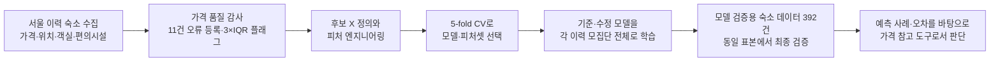
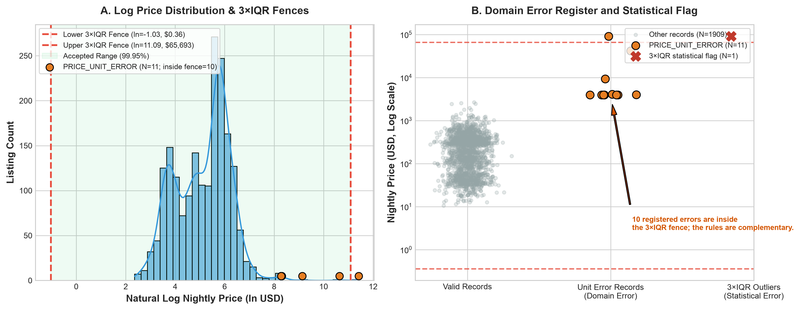
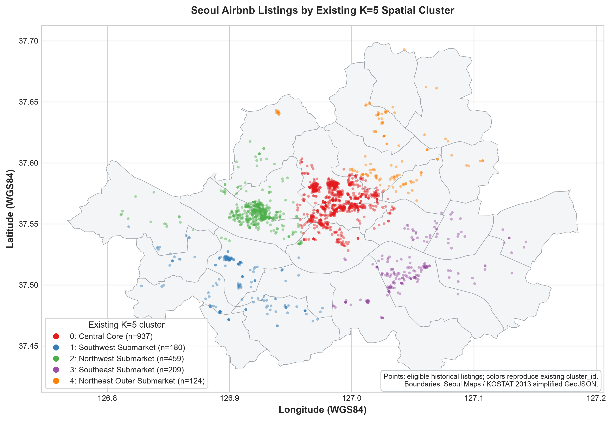
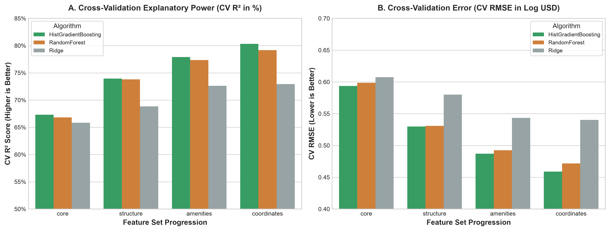
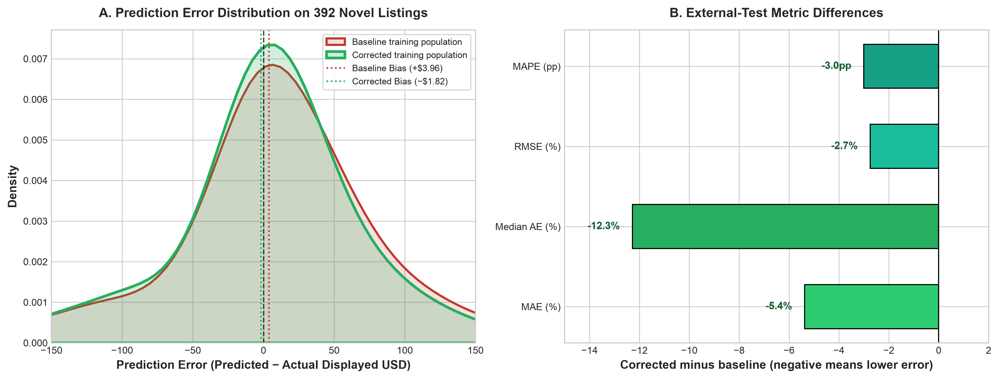
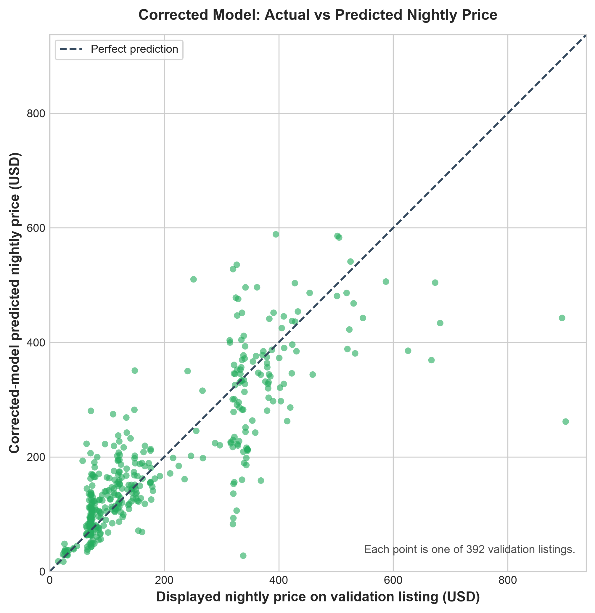

# 서울 Airbnb 1박 가격 예측 모델

2025년 기준 에어비엔비에 등록된 서울 소재 숙소는 17,000여곳에 달한다고 한다.
이때 새로 숙소를 여는 호스트는 숙박료를 어떻게 책정하는게 좋을까? 너무 저렴해도, 너무 비싸도 손해를 볼테니 적정 가격을 미리 알 수 있다면 좋을 것이다.

이 프로젝트는 에어비엔비 숙소의 1박 가격을 Y값으로 정하고 이를 예측하기 위해 어떤 X 변수를 탐구·정의·선택했는지, 그리고 그 X 변수로 만든 모델이 모델 검증용 숙소 데이터에서 어느 정도의 예측력을 보였는지를 설명한다.

## 1. 데이터 수집과 목표변수(Y) 설정

### 데이터 수집
크롤링을 통해 서울 인근 에어비엔비 숙소 1,955건의 정보를 수집했다. 수집된 데이터셋은 총 37개 변수를 포함하고 서울 외곽지역을 제외한 서울 내 고유 숙소는 총 1,920건이다. 데이터셋은 숙소의 위치·객실·편의시설과 함께 숙박 기간에 대한 총 숙박요금을 포함한다.

### Y 설정
이 보고서에서 예측할 Y는 **숙소의 1박당 가격을 로그로 바꾼 값**이다. 먼저 각 숙소의 총 숙박요금을 그 견적의 숙박일수로 나눠 1박 가격으로 맞춘다.

그 다음 1박 가격에 로그를 적용한다. 숙소 가격은 몇 배씩 차이 날 수 있어, 원래 가격 그대로 학습하면 매우 비싼 숙소 몇 개가 모델의 오차를 과도하게 좌우할 수 있기 때문이다. 로그 변환은 가격 분포를 덜 치우치게 만들어 모델이 일반적인 가격대의 차이도 함께 학습하도록 돕는다. 모델은 로그 가격을 예측하고, 최종적으로 다시 1박 가격으로 변환해 제시한다.

수용 인원으로 다시 나눈 1박 가격은 보조 분석용 결과다. 최종 모델과 모델 검증용 숙소 데이터 평가는 **주된 1박 가격 Y**를 사용한다.

## 2. 데이터 수집·분석 단위·데이터 품질

### 분석 단위와 모집단

원천은 두 차례 크롤링을 통합한 이력 숙소 데이터다. 분석 단위는 **숙소 1건당 1행**이며, 서울로 분류된 이력 숙소는 1,920건이다. 가격·좌표·군집·객실 요약·편의시설은 숙소 ID로 결합하고, 다대일인 편의시설과 텍스트 요약은 숙소 단위로 집계한 뒤 붙인다.

서울 외 숙소, 양수가 아닌 가격, 필요한 공통 결과값이나 수용 인원이 없는 행은 학습 모집단에서 제외했다.

### 가격 품질 감사

가격 분포의 3×IQR 로그 울타리는 약 **$0.36~$65,693/night**이다. 가격 단위 오류로 등록된 11건의 가격은 약 **$3,949~$91,011/night** 범위이며, $91,011인 1건만 3×IQR 통계 플래그에도 걸린다. 나머지 10건은 통계 울타리 안에 남는다.

따라서 3×IQR은 분포상 극단값을 표시하는 투명한 규칙이지만, 통화 단위나 가격 구성요소가 잘못 읽혔는지 판별하는 규칙은 아니다. 통계 플래그와 가격 단위 오류 감사 기록을 별도로 보존한다.

기준 모델은 기존 절차를 재현해 3×IQR에 걸린 등록 오류 1건만 제외하고 나머지 10건을 포함한다. 수정 모델은 가격 단위 오류 11건을 먼저 제외하고 동일한 3×IQR 규칙을 적용한다.

| 학습 모집단 | 가격 단위 오류 제외 | 3×IQR 통계 플래그 | 3×IQR로 추가 제외 | 최종 학습 행 |
| --- | ---: | ---: | ---: | ---: |
| 기준 모델 | 0 | 1 | 0 | 1,919 |
| 수정 모델 | 11 | 1 | 0 | 1,909 |

## 3. 후보 X 변수 탐구와 제외한 변수의 이유

후보 X는 새 숙소가 시장에 제시될 때 알 수 있는 물리적·구조적·공간적 특성으로 제한했다.

| 변수 그룹 | 탐구한 변수 | 채택 원칙 |
| --- | --- | --- |
| 숙소 기본 특성 | 임대 방식(집 전체·개인실 등), 건물·숙소 유형 | 숙소의 판매 단위와 형태를 직접 설명하는 범주형 특성 |
| 수용·객실 구성 | 최대 수용 인원, 침실·침대·욕실 수 | 규모와 수용 구조를 나타내되, 실제 투숙 인원으로 해석하지 않음 |
| 편의시설 | 이용 가능한 편의시설 수와 10개 핵심 편의시설 보유 여부 | 희소한 원본 편의시설 전체 대신 해석 가능한 저차원 표현 |
| 위치 | 기존 K=5 공간 군집, 동서 방향 좌표, 남북 방향 좌표 | 넓은 공간 군집과 연속 위치를 후보로 비교 |

다음 변수들은 제외했다.

| 제외 그룹 | 예시 | 제외 이유 |
| --- | --- | --- |
| 호스트 프로필 | 호스트 정보, 공동 호스트, 활동·평판 정보 | 관측 시점이 가격보다 앞선다는 보장이 없고, 개인 단위 식별 신호가 될 수 있음 | |
| 리뷰 평점 | 리뷰·평점, 예약 가능 일수 | 가격 관측과의 시간 선후관계 및 가격과의 상호영향이 불명확 |
| 행정구역 | 자치구 | 위치 표현의 중복을 줄이기 위해 감사용으로만 보존 |

이 제외는 “이 변수들이 가격과 무관하다”는 뜻이 아니다. 여기서는 새 숙소 가격을 예측하는 데 사용할 수 있는지를 기준으로 삼았다.

## 4. 피처 엔지니어링: 객실, 편의시설, 수용 인원, 위치, 군집, 좌표

### 객실·수용 인원

최대 수용 인원은 원값 그대로 모델에 넣는다. 수용 인원 원값과 로그 변환값을 나머지 조건이 같은 5-fold 교차검증으로 비교했을 때 CV MAE·RMSE·R²가 모두 같았으므로, 해석이 쉬운 원값을 선택했다. 이는 실제 투숙 인원이나 실제 예약 인원을 뜻하지 않는다.

침실·침대·욕실 수는 숙소가 표시한 객실 요약 문구에서 정해진 패턴으로만 읽는다. `Studio`는 침실 0개, `No bathroom`은 욕실 0개로 처리한다. 서로 모순되는 반복 숫자는 추정하지 않고 결측으로 남긴다. 마케팅 문구에서 방 개수를 추론하지 않는다.

### 편의시설

편의시설 수는 이용 가능한 고유 편의시설의 개수다. 다음 10개 보유 여부는 원본 이름·아이콘의 명시적 규칙으로 만든다: 주방, 세탁기, 건조기, 업무공간, 엘리베이터, 무료 주차, 온수 욕조, 욕조, 셀프 체크인, 별도 출입구.

원본 amenity 카탈로그 전체를 고차원 희소 행렬로 만들지 않고, 이 10개 플래그와 개수를 사용한다. PCA는 적용하지 않았다. 성능이 낮아진다는 PCA 실험 결과는 없으며, 현재 표현이 작고 해석 가능한 혼합형 변수라는 이유로 적용하지 않은 것이다. PCA를 채택하려면 동일 CV에서 별도 후보 파이프라인으로 비교해야 한다.

### 위치·군집·좌표

위경도는 각도 단위이므로 서울 안의 평면적 위치를 표현하기 위해 EPSG:5179로 투영한 뒤 동서·남북 방향의 km 좌표로 바꿨다. 두 좌표는 서로 별개의 위치 개념이 아니라 하나의 위치 좌표쌍이다. 기존 K=5 공간 군집은 범주형 레이블이며, 거리 순서나 행정구역을 뜻하지 않는다.

지도는 2013년 서울 25개 구 경계를 배경으로 수정 모델의 이력 학습 모집단 1,909개 숙소를 표시한다. 다섯 색은 새로 계산한 군집이 아니라 기존 공간 군집을 재현한다. 행정경계는 위치 맥락을 위한 배경일 뿐 모델 입력은 아니다.

트리 모델은 동서·남북 좌표에 대해 축에 수직인 분할을 만들 수 있고, 공간 군집은 넓은 위치 범주를 제공한다. 두 표현의 신호는 겹칠 수 있다. 이 분석은 좌표만·군집만·둘 다·둘 다 제외한 비교를 별도로 설계하지 않았으므로, 둘의 독립 기여나 결합 효과를 주장하지 않는다.

## 5. 모델 후보와 CV 비교

4절에서 정의한 X는 이 시점까지는 **후보 입력 특성**이다. 여기서는 각 X 묶음과 세 후보 모델의 조합을 비교한 뒤, 가장 적절한 조합을 최종 선택한다. 처음부터 HistGradientBoosting 하나만 정해 놓고 X를 넣은 것은 아니다.

세 후보 모델은 가격과 숙소 특성의 관계를 서로 다른 방식으로 학습한다.

| 후보 모델 | 어떻게 예측하는가 | 장점 | 한계 |
| --- | --- | --- | --- |
| Ridge | 각 특성의 효과를 직선처럼 더해 가격을 추정하는 선형 모델 | 빠르고 단순하며, 복잡한 모델이 정말 필요한지 판단하는 기준선이 됨 | 위치·객실·편의시설이 함께 작용하는 복잡한 패턴을 충분히 담기 어려움 |
| Random Forest | 서로 다른 작은 결정 트리를 많이 만들고, 그 예측의 평균을 냄 | 비선형 관계와 특성 간 조합을 다룰 수 있고 결과가 비교적 안정적임 | 트리들이 앞선 오차를 고치며 학습하지는 않아, 같은 계산량에서 세밀한 패턴을 덜 잡을 수 있음 |
| HistGradientBoosting | 작은 결정 트리를 순서대로 더하며, 앞 단계가 놓친 오차를 다음 단계가 줄임 | 비선형 관계와 특성 조합을 효율적으로 학습할 수 있음 | 하나의 직관적인 방정식으로 설명하기 어렵고, 설정에 따라 과하게 학습할 수 있음 |

비교를 공정하게 하기 위해 모든 후보에 같은 전처리 원칙을 적용했다. 수치형 값이 비어 있으면 학습 fold의 중앙값으로 채우고, 값이 비어 있었다는 사실도 함께 표시했다. 범주형 값이 비어 있으면 별도 범주로 두고, 임대 방식처럼 글자로 된 값은 모델이 읽을 수 있는 0·1 열로 바꿨다. 아주 드문 범주는 해당 학습 fold 안에서만 하나로 묶었다. 이 작업을 검증에 쓸 숙소까지 미리 보고 수행하면 답을 미리 아는 셈이 되므로, 매 fold의 학습 부분에서만 다시 적합했다.

| 후보 | 비교한 설정 |
| --- | --- |
| Ridge | 복잡한 계수를 줄이는 강도 3가지(1, 10, 100) |
| HistGradientBoosting | 트리 하나의 최대 끝 노드 수 2가지(7, 15), 최대 160단계의 순차 학습, 학습 속도 0.06, 규제 강도 1 |
| Random Forest | 각 트리 끝 노드에 필요한 최소 숙소 수 2가지(3, 10), 트리 120개 |

교차검증(CV)은 이력 숙소를 5개 묶음으로 나누고, 매번 4개 묶음으로 학습한 뒤 남은 1개 묶음으로 시험하는 과정을 5번 반복하는 방법이다. `random_state=42`는 이 나누는 방식을 다시 실행해도 같게 만드는 고정값이다. 여기서는 각 학습 모집단 전체에서 무작위로 섞은 5-fold CV를 수행했다.

평균 CV RMSE가 가장 낮은 후보를 우선했다. 다만 차이가 1% 이내면 우연한 분할 차이일 수 있으므로, 더 단순한 모델·더 적은 입력 수·fold별 성적 변동이 작은 쪽을 우선하는 규칙을 미리 정했다. 내부 80:20 홀드아웃은 만들지 않았고, 최종 예측력은 뒤의 모델 검증용 숙소 데이터로 확인한다.

수정 모집단에서 선택된 후보의 CV 성적은 다음과 같다. 이 지표는 로그 Y에 대한 **모델 선택 지표**이며, 다음 절의 모델 검증용 숙소 데이터 가격 오차와 척도가 다르다.

| 모델 | 학습 행 | 선택 알고리즘·피처셋 | CV MAE (log USD) | CV RMSE (log USD) | CV R² |
| --- | ---: | --- | ---: | ---: | ---: |
| 기준 | 1,919 | HistGradientBoosting / coordinates | 0.3342 | 0.5079 | 0.7718 |
| 수정 | 1,909 | HistGradientBoosting / coordinates | 0.3125 | 0.4588 | 0.8034 |

## 6. 최종 모델, 최종 X 변수 전체 목록, 모델 설명

최종 선택한 모델은 **HistGradientBoostingRegressor**다.
여러 작은 결정 트리를 순서대로 더하며, 앞선 트리가 남긴 오차를 다음 트리가 줄이는 방식의 gradient boosting 모델이다. 선형 회귀의 하나의 1차 방정식으로 표현되지는 않는다. 선택된 설정은 `max_leaf_nodes=15`, `max_iter=160`, `learning_rate=0.06`, `l2_regularization=1`, `random_state=42`다.

최종 모델은 품질 규칙을 통과한 1,909개 이력 숙소 전체로 재학습한다. 최종 입력 특성은 아래 20개다.

| X 그룹 | 최종 입력 특성 |
| --- | --- |
| 수용 인원·유형 | 최대 수용 인원, 임대 방식, 건물·숙소 유형 |
| 위치 | 기존 K=5 공간 군집, 동서 방향 좌표, 남북 방향 좌표 |
| 객실 구성 | 침실 수, 침대 수, 욕실 수 |
| 편의시설 | 이용 가능한 편의시설 수, 주방 보유 여부, 세탁기 보유 여부, 건조기 보유 여부, 업무공간 보유 여부, 엘리베이터 유무, 무료 주차 가능 여부, 온수 욕조 유무, 욕조 유무, 셀프 체크인 가능 여부, 별도 출입구 유무 |

각 트리는 예를 들어 숙소 유형·수용 규모·좌표·편의시설 조합에 따라 데이터 공간을 나누고, 여러 트리의 출력을 합쳐 로그 1박 가격을 예측한다. 따라서 단일 X의 “다른 조건이 같을 때 가격 효과”를 선형 계수처럼 읽을 수 없다. 이 모델은 예측 패턴을 학습하며, 인과적 가격 효과를 추정하지 않는다.

## 7. 모델 예측력 검증

최종 검증은 모델 학습에 사용하지 않은 392개 숙소를 대상으로 수행했다.

모델 검증용 숙소 데이터의 Y는 `5 nights x $...`에 있는 기본 1박 표시 가격이다. MAPE는 `mean(|예측 USD − 표시 USD| / 표시 USD)`로 계산한다. 기준·수정 비교는 가격 오류 제외가 이 검증 표본의 예측 오차와 어떤 관계가 있는지 보기 위한 비교다.

| 모델 검증용 숙소 데이터 평가 지표 | 기준 모델 | 수정 모델 | 수정 − 기준 |
| --- | ---: | ---: | ---: |
| 예측·관측 커버리지 | 392 | 392 | 0 |
| MAE (USD) | 56.81 | 53.76 | -3.05 |
| RMSE (USD) | 87.02 | 84.63 | -2.39 |
| MAPE | 35.3% | 32.3% | -3.0%p |
| 중앙 절대 오차, MedAE (USD) | 35.54 | 31.18 | -4.36 |
| 평균 편향, 예측−표시 가격 (USD) | 3.96 | -1.82 | -5.78 |

이 392개 표본에서는 수정 모델의 MAE·RMSE·MAPE·MedAE가 모두 낮다. 이는 품질 오류를 제외한 학습이 이 표본에서 더 낮은 예측 오차와 연관되어 있음을 보여준다. 하지만 이 결과만으로 11건의 오류 제거가 개선을 일으켰다고 단정하거나 통계적 유의성을 주장하지 않는다. 같은 외부 행의 오차 차이에 대한 paired bootstrap 신뢰구간 또는 permutation test가 필요하다.

## 8. 한계·재현성

- 모델 검증용 숙소 데이터가 대표성을 갖는 표본인지 확인하지는 못했다.
- 학습과 검증은 둘 다 1박당 USD 가격으로 계산한다. 다만 학습 Y는 총 체류 표시금액을 숙박일수로 나눈 1박 가격이고, 검증 Y는 표시된 기본 1박 가격이다. 수수료·세금·할인 포함 범위가 다르면 USD 오차 일부는 모델 오류가 아니라 가격 구성 정의 차이일 수 있다.
- 수집 시점, 숙박일, 계절, 요금 구성요소가 이력 데이터와 다를 수 있다. 모델 검증용 숙소 데이터 평가는 시간-이질적 비교이지 완전한 동시점 벤치마크가 아니다.
- 기존 K=5 공간 군집은 전체 좌표로 구축된 표현이다. 공간 분할 일반화와 각 위치 특성의 독립 기여를 보려면 공간적으로 분리한 CV와 위치 특성 조합 비교가 필요하다.
- 가격 단위 오류 등록은 제외 판단의 기록이며, 올바른 가격을 자동으로 보정한 자료가 아니다.

실무에서는 개별 숙소의 확정 가격이 아니라 비교 가능한 숙소의 가격 범위를 찾는 참고자료로 쓰는 것이 적절하다.

### 재현성

모델 선택은 `random_state=42`인 shuffled 5-fold 교차검증으로, 최종 평가는 학습에 쓰지 않은 동일한 392개 숙소로 수행했다. 가격 오류 등록·통계 플래그·최종 학습 행 수·예측값·평가 지표는 SQLite 결과 테이블에 함께 남겨 두었다. 실행 후 데이터베이스의 외래키 검사와 빠른 무결성 검사를 통과했으며, 내부 홀드아웃 예측 행은 만들지 않았다.

## 9. 모델 사용 결과와 정확도 판단

새 숙소의 숙소 유형, 수용 인원, 객실 구성, 편의시설, 위치 좌표와 공간 군집을 입력하면 수정 모델은 그 조합에 해당하는 **1박 가격 추정치**를 낸다.

아래 표는 모델 검증용 숙소 데이터 392건 가운데 절대 오차가 가장 작은 3건과 가장 큰 3건을 함께 골랐다. 잘 맞은 사례만 제시하지 않았으며, 객실·욕실 정보가 없는 경우에는 원자료의 요약값도 없었다는 뜻으로 `—`로 표시했다.

| 선정 기준 | 숙소 특성 요약 | 실제 1박 가격 | 수정 모델 예측 | 절대 오차 |
| --- | --- | ---: | ---: | ---: |
| 작은 오차 1위 | 집 전체 · 2인 · 침실 1 · 침대 2 · 욕실 1 · 편의시설 38개 | $108.53 | $108.53 | $0.00 |
| 작은 오차 2위 | 집 전체 · 4인 · 침실 1 · 침대 2 · 욕실 1 · 편의시설 36개 | $114.39 | $114.41 | $0.02 |
| 작은 오차 3위 | 집 전체 · 4인 · 침실 1 · 침대 2 · 욕실 1 · 편의시설 36개 | $162.05 | $162.17 | $0.12 |
| 큰 오차 3위 | 개인실 · 1인 · 침실 — · 침대 1 · 욕실 — · 편의시설 32개 | $337.98 | $27.64 | $310.34 |
| 큰 오차 2위 | 집 전체 · 16인 · 침실 4 · 침대 8 · 욕실 2 · 편의시설 41개 | $894.87 | $442.68 | $452.19 |
| 큰 오차 1위 | 개인실 · 2인 · 침실 — · 침대 1 · 욕실 — · 편의시설 8개 | $901.23 | $261.76 | $639.47 |

그림의 점 하나는 검증 숙소 하나다. 점이 대각선에 가까울수록 실제 표시 1박 가격과 예측 가격이 가깝고, 멀수록 오차가 크다. 높은 가격대에서 대각선 아래에 있는 점들은 실제 가격보다 낮게 예측한 사례다.

전체 392건에서 수정 모델은 모두 가격을 예측했다. **MAE $53.76**은 한 숙소당 절대 오차의 평균이고, **중앙 절대 오차 $31.18**은 절반의 숙소가 이 값보다 작은 오차를 보였다는 뜻이다. **RMSE $84.63**이 MAE보다 큰 것은 일부 숙소에서 큰 오차가 있었기 때문이다. **MAPE 32.3%**는 표시 가격 대비 절대 오차의 평균 비율이며, 가격이 낮은 숙소일수록 같은 달러 오차도 더 크게 보일 수 있다.

가격 참고 도구로 사용할지는 다음 질문으로 판단할 수 있다.

- 일반 숙소에서의 중앙 오차 약 $31가 내가 허용할 수 있는 가격 차이인가?
- 평균 오차와 RMSE 사이의 차이처럼, 일부 숙소에서 큰 오차가 생길 가능성을 감수할 수 있는가?
- 제시 가격을 확정 가격이 아니라 인근·유사 숙소를 다시 조사할 가격 범위로 사용할 수 있는가?
- 수집 시점, 숙박일, 수수료·세금·할인 구성이 달라져도 이 결과와 같은 오차를 기대하려 하는가?

현재 검증 표본에서 수정 모델은 숙소 392건 전체를 예측했고, 전형적인 오차는 약 $31, 평균 절대 오차는 약 $54였다. 따라서 이 모델은 새 숙소의 가격 조사를 시작할 **가격 범위 참고 도구**로는 사용할 수 있지만, 큰 오차 사례가 있으므로 개별 숙소의 확정 가격을 자동으로 결정하는 용도로는 충분하지 않다.
