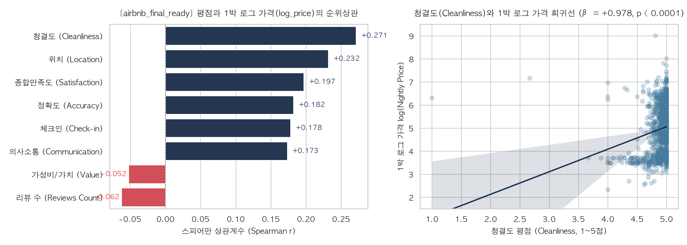

# Airbnb Seoul 평점 변수 및 가격 연관성 분석 보고서

**작성일시:** 2026-09-04  
**대상 데이터셋:** [`airbnb_final_ready.sas7bdat`](file:///Users/stevenjang/Documents/Projects/airbnb/airbnb_final_ready.sas7bdat) (1,247행 × 26열)  
**종속변수($Y$):** `log_price` (1박 요금 `price_numeric`의 자연로그 변환값)  
**분석 변수($X$):** 세부 평점 7종 및 리뷰 수 (`rating_*`)

---

## 1. 분석 배경 및 목적

에어비앤비 숙소에는 숙소 환경과 호스트 서비스를 평가하는 다각도의 평점 기준이 존재합니다. 본 분석의 목적은 다음과 같습니다:

1. **가격 결정 요인 탐색**: 여러 평점 항목 중 **숙소의 1박 가격(`log_price`)과 가장 밀접한 연관성을 갖는 평점이 무엇인지 규명**합니다.
2. **최종 모델링 전략 수립**: 이후 숙소의 물리적 특성(인원, 침실 수) 및 입지 요인과 결합하여 **설명력 높은 종합 가격 예측 모델**을 구축하기 위한 평점 변수 처리 방향(단일 변수 선택 vs 주성분 분석 PCA)을 도출합니다.

---

## 2. 데이터 기초 통계량 및 결측치

* **전체 관측치**: 1,247건
* **결측치**: 신규 등록 등으로 리뷰가 없는 77건 (전체 평점 변수 동일 결측)
* **유효 분석 샘플 수**: **1,170건** (결측치 제외)

| 변수명 | 변수 설명 | 평균 (Mean) | 표준편차 (Std) | 중앙값 (Median) | 최솟값 (Min) | 최댓값 (Max) |
| :--- | :--- | :---: | :---: | :---: | :---: | :---: |
| `price_numeric` | 1박 숙박 요금 (USD) | 279.37 | 455.29 | 151.91 | 10.23 | 8,194.75 |
| **`log_price` ($Y$)** | **1박 로그 요금** | **5.018** | **1.095** | **5.023** | **2.325** | **9.011** |
| `rating_cleanliness` | 청결도 평점 | 4.886 | 0.212 | 4.950 | 1.000 | 5.000 |
| `rating_location` | 위치 평점 | 4.849 | 0.221 | 4.890 | 1.000 | 5.000 |
| `rating_guestSatisfaction` | 종합 만족도 | 4.900 | 0.195 | 4.950 | 1.000 | 5.000 |
| `rating_accuracy` | 정보 정확도 | 4.912 | 0.173 | 4.950 | 1.000 | 5.000 |
| `rating_checking` | 체크인 과정 | 4.931 | 0.160 | 4.960 | 1.000 | 5.000 |
| `rating_communication` | 의사소통 | 4.937 | 0.212 | 4.990 | 1.000 | 5.000 |
| `rating_value` | 가격 대비 가치 (가성비) | 4.854 | 0.209 | 4.895 | 1.000 | 5.000 |
| `rating_reviewsCount` | 누적 리뷰 수 | 76.23 | 160.72 | 36.00 | 1.00 | 3,744.00 |

> **통계적 특징**: 평점 데이터 대부분이 4.8~4.9점대에 집중되어 있는 강한 좌측 왜도(Left-skewed) 특성을 보이며, 가격 변수는 로그 변환(`log_price`)을 통해 정규분포에 근사하게 안정화되었습니다.

---

## 3. 가격($Y$)과의 연관성 분석 결과

극단값에 강건한 **스피어만 순위상관계수($r_s$)**와 **1:1 단순 선형회귀분석**($\text{log\_price} = \beta_0 + \beta_1 X$)을 병행하여 순위를 도출했습니다.

| 순위 | 독립변수 ($X$) | 항목 | Spearman $r_s$ | Pearson $r$ | 회귀계수 ($\beta$) | $t$-값 | $p$-value | 설명력 ($R^2$) | 통계적 유의성 |
| :---: | :--- | :--- | :---: | :---: | :---: | :---: | :---: | :---: | :---: |
| 🥇 **1위** | `rating_cleanliness` | **청결도** | **+0.2713** | **+0.1988** | **+0.9777** | **6.93** | **$6.8 \times 10^{-12}$** | **3.95%** | **매우 유의 ($p < 0.001$)** |
| 🥈 **2위** | `rating_location` | **위치** | **+0.2318** | **+0.1003** | **+0.4735** | **3.44** | **0.00059** | **1.01%** | **매우 유의 ($p < 0.001$)** |
| 🥉 **3위** | `rating_guestSatisfaction` | **종합만족도** | **+0.1970** | **+0.0887** | **+0.4741** | **3.04** | **0.00240** | **0.79%** | **유의 ($p < 0.01$)** |
| 4위 | `rating_accuracy` | 정확도 | +0.1823 | +0.0667 | +0.4035 | 2.29 | 0.02242 | 0.45% | 유의 ($p < 0.05$) |
| ⚡ **특이** | `rating_value` | **가성비** | **-0.0524** | **-0.0945** | **-0.4720** | **-3.24** | **0.00121** | **0.89%** | **매우 유의 (음의 관계)** |
| 5위 | `rating_communication` | 의사소통 | +0.1733 | -0.0254 | -0.1250 | -0.87 | 0.38503 | 0.06% | 유의하지 않음 ($p > 0.05$) |
| 6위 | `rating_reviewsCount` | 리뷰 수 | -0.0625 | -0.0218 | -0.0001 | -0.75 | 0.45547 | 0.05% | 유의하지 않음 ($p > 0.05$) |
| 7위 | `rating_checking` | 체크인 | +0.1780 | +0.0086 | +0.0564 | +0.29 | 0.76821 | 0.01% | 유의하지 않음 ($p > 0.05$) |

---

## 4. 핵심 인사이트 요약

### ① 가격과 가장 연관성이 높은 평점: 청결도 (`rating_cleanliness`)
* 회귀계수 **$\beta = +0.978$**, 설명력 **$R^2 = 3.95\%$**로 8개 지표 중 압도적 1위입니다.
* 청결도 평점이 높을수록 객단가가 가파르게 상승합니다. 프리미엄 숙소일수록 전문 세탁 및 방역/위생 관리에 자원을 투입하며, 게스트 역시 높은 가격대 숙소에서 청결도를 핵심 가치로 인식합니다.

### ② 입지 프리미엄을 반영하는 위치 평점 (`rating_location`)
* 스피어만 상관계수 $+0.232$, $\beta = +0.474$($p < 0.001$)로 가격 견인력 2위입니다.
* 강남, 홍대, 명동 등 서울 핵심 상권 및 역세권 숙소의 높은 지대와 가격대가 평점과 직결됩니다.

### ③ 가격이 비쌀수록 깎이는 가성비 평점 (`rating_value`의 역설)
* 회귀계수가 **$\beta = -0.472$ ($p = 0.0012$)로 뚜렷한 음(-)의 관계**를 보입니다.
* 1박 요금이 비싼 숙소일수록 게스트의 기대 수준이 극도로 높아져, 사소한 단점에도 "가격 대비 가치" 점수를 엄격하고 낮게 매기는 소비자 심리가 통계적으로 입증되었습니다.

### ④ 체크인과 의사소통은 가격 차별화 요소가 아님
* `rating_checking`($p = 0.768$)과 `rating_communication`($p = 0.385$)은 가격과의 선형 관계가 전혀 유의하지 않습니다.
* 신속한 응대와 원활한 체크인은 숙소 등급(저가 vs 고가)에 상관없이 모든 호스트가 갖추어야 할 **'기본적인 위생 요인(Hygiene Factor)'**에 불과합니다.

---

## 5. 다중공선성(VIF) 점검

평점 변수 간 상호 상관관계가 매우 높아 다중공선성 위험이 존재합니다.

| 변수 | VIF (분산팽창계수) | 판정 |
| :--- | :---: | :--- |
| `rating_guestSatisfaction` | **7.366** | 높음 (주의) |
| `rating_accuracy` | **5.202** | 높음 (주의) |
| `rating_cleanliness` | **3.736** | 보통 |
| `rating_value` | **3.307** | 보통 |
| `rating_checking` | **3.180** | 보통 |
| `rating_communication` | **2.158** | 양호 |
| `rating_location` | **2.081** | 양호 |
| `rating_reviewsCount` | **1.013** | 매우 양호 |

> **통계적 시사점**: 종합만족도, 정확도, 청결도 등은 상호 상관계수가 $0.7$을 초과합니다. 8개 평점을 모두 하나의 다중회귀 모델에 넣을 경우 회귀계수의 부호 왜곡 및 표준오차 급증(다중공선성 문제)이 발생합니다.

---

## 6. 확인한 내용

1. rating_guestSatisfaction 은 세부리뷰 점수들의 단순 평균이 아닌 독립적인 변수이다. 경우에 따라 세부리뷰 항목들의 평균보다 종합 리뷰 점수가 높기도 낮기도 하다

2. rating_value (가성비)는 모든 관측치(숙소)를 기준으로 음의 상관관계를 보인다. 이는 가성비가 좋을수록 숙소 가격이 낮아진다는 의미로 해석되기 때문에 납득하기 어려워 후속 조사를 했다.

 음의 상관관계를 가졌다는게 납득이 안 된다. 좀 더 공정한 비교를 위해서는 비슷한 가격대의 숙소에서 rating_value 이 낮은 경우와 높은 경우를 비교했을때 어느정도 차이를 보이는지 확인할 필요가 있다.

### 2. rating_value가 음의 상관관계를 가졌다는게 납득이 안 된다. 좀 더 공정한 비교를 위해서는 비슷한 가격대의 숙소에서 rating_value 이 낮은 경우와 높은 경우를 비교했을때 어느정도 차이를 보이는지 확인할 필요가 있다.

레이팅 가변수
리뷰가 존재하는지 아닌지 여부를 바이너리 가변수로 만들어서 구분해본다.